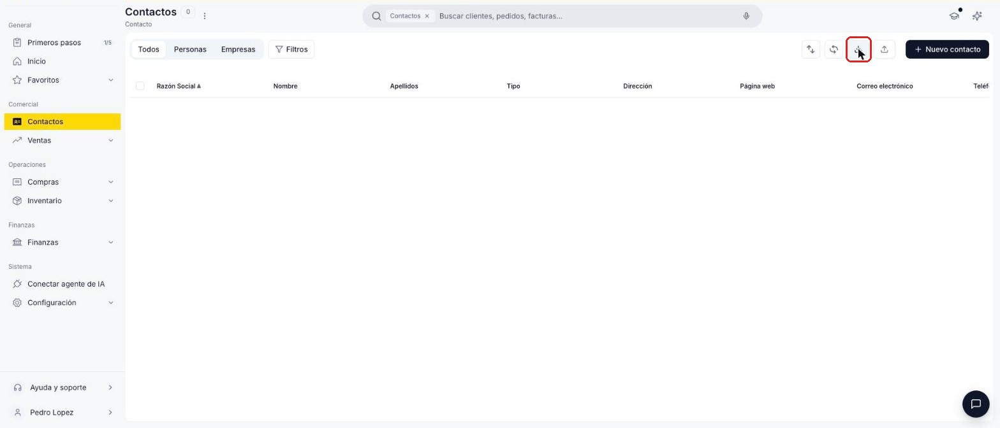
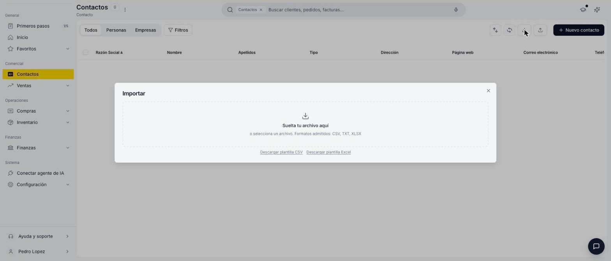
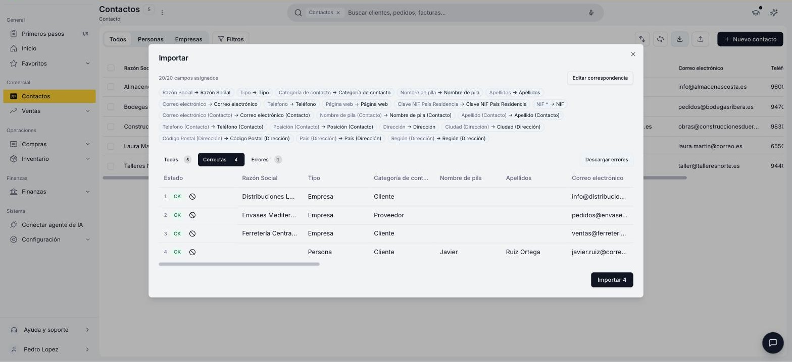
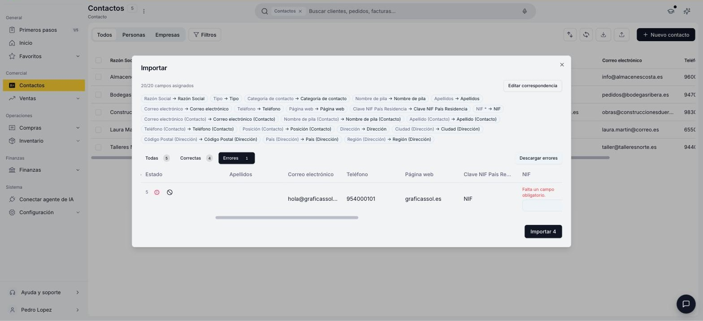
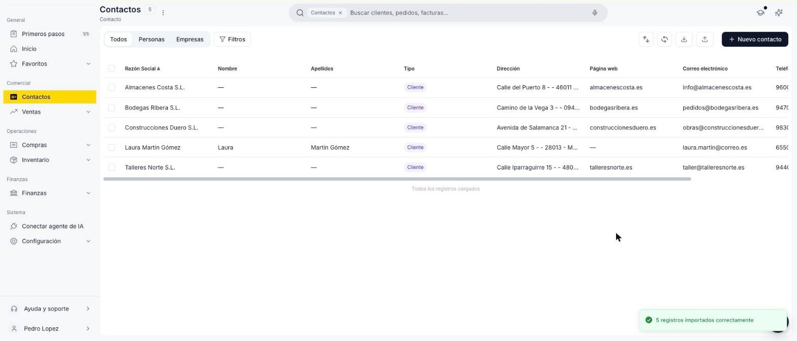

# Importar contactos

Si necesitas cargar varios contactos a la vez, en vez de crearlos uno por uno desde el formulario, puedes importarlos masivamente desde un archivo CSV, TXT o Excel.

## Antes de empezar

- **Solo se crean contactos nuevos, con una persona de contacto y una dirección cada uno.** Si el contacto ya existe, la fila se omite. Si repites el mismo NIF en varias filas, solo se importa la primera. Las personas y direcciones adicionales se añaden después desde las solapas **Persona** y **Dirección** del contacto.
- **Todos los contactos se importan con el rol Cliente.** Si alguno es proveedor, activa ese rol después desde la solapa **Financiero**, como se explica en [Cómo crear un contacto](../como-crear-un-contacto/como-crear-un-contacto.md).

## Abre la ventana de importación

1. Ve a **[Contactos](https://app.etendo.ai/contacts){target="_blank"}**.
2. En la vista lista, haz clic en el ícono **Importar** de la barra de herramientas superior.

    <figure markdown="span">
      
      <figcaption>Ícono Importar en la barra de herramientas de la ventana Contactos.</figcaption>
    </figure>

## Descarga y completa la plantilla

1. En la ventana **Importar**, descarga la plantilla en **CSV** o **Excel**.

    <figure markdown="span">
      
      <figcaption>Ventana Importar: zona de carga de archivo y enlaces de descarga de plantilla.</figcaption>
    </figure>

2. Completa una fila por contacto. Consulta qué va en cada columna en [Columnas de la plantilla](#columnas-de-la-plantilla).
3. Vuelve a la ventana **Importar** y arrastra tu archivo a la zona indicada, o haz clic para seleccionarlo desde tu ordenador.

## Columnas de la plantilla

| Columna | Obligatoria | Qué poner |
|---|---|---|
| **Tipo** | No | **Persona** o **Empresa**. Cualquier otro valor (por ejemplo, *Proveedor*) marca la fila como error. |
| **Razón Social** | Sí, si es Empresa | Nombre o razón social. En una Persona se forma con el nombre y los apellidos. |
| **Nombre de pila** y **Apellidos** | Sí, si es Persona | No se usan en una Empresa. |
| **NIF** | Sí | Etendo comprueba que el dígito de control sea correcto. |
| **Clave NIF País Residencia** | No | Tipo de identificador fiscal (NIF, CIF, VAT, etc.). Si la dejas vacía, se asigna **NIF**. |
| **Categoría de contacto** | No | Ej. *Cliente*, *Proveedor*. Si la dejas vacía, se asigna **Cliente**. Si no existe, se crea automáticamente. |
| **Correo electrónico**, **Teléfono**, **Página web** | No | Datos de contacto generales. |
| Columnas **(Contacto)**: correo, nombre, apellido, teléfono y posición | No | Una persona de contacto vinculada (solapa **Persona**). |
| Columnas **(Dirección)**: dirección, ciudad, código postal, país y región | No | Una dirección, que queda marcada como dirección de envíos y de facturación (solapa **Dirección**). |

## Revisa la correspondencia de columnas

1. Comprueba que cada columna de tu archivo esté emparejada con su campo (por ejemplo, la columna **NIF** con el campo **NIF**). Encima de la lista aparece cuántos campos se asignaron, por ejemplo "20/20 campos asignados".
2. Si alguna columna no se asignó bien, haz clic en **Editar correspondencia** y corrígela.

## Revisa las filas correctas y con errores

Etendo separa las filas de tu archivo en tres pestañas: **Todas**, **Correctas** (listas para importarse) y **Errores** (con el motivo en rojo junto al campo, por ejemplo "Falta un campo obligatorio.").

<figure markdown="span">
  
  <figcaption>Pestaña Correctas: filas validadas, listas para importar.</figcaption>
</figure>

<figure markdown="span">
  
  <figcaption>Pestaña Errores: fila sin NIF, editable en la misma tabla.</figcaption>
</figure>

Para cada fila de la pestaña **Errores**, elige una opción:

- **Corregirla en la tabla:** escribe el dato en la celda resaltada. Al salir de la celda, la fila pasa a **Correctas**.
- **Corregirla en tu archivo:** haz clic en **Descargar errores**, corrige esas filas y vuelve a importarlas después.
- **Dejarla fuera:** haz clic en el icono **Omitir** (⊘) de la fila.

!!! info "Importar solo lo que está correcto"
    No hace falta que corrijas los errores para avanzar: el botón **Importar** solo carga las filas de la pestaña **Correctas**.

## Importa los contactos

1. Haz clic en **Importar [cantidad]**.
2. En el diálogo **Confirmar importación**, revisa cuántos registros se importan y cuántas filas se omiten. Luego haz clic en **Confirmar importación**.
3. Espera a que termine la barra de progreso. El mensaje "[cantidad] registros importados correctamente" confirma la carga, y los contactos ya aparecen en la vista lista.

    <figure markdown="span">
      
      <figcaption>Vista lista de Contactos después de una importación exitosa.</figcaption>
    </figure>

## Artículos Relacionados

- [¿Qué es la sección Contactos?](../que-es-la-seccion-contactos/que-es-la-seccion-contactos.md)
- [Cómo crear un contacto](../como-crear-un-contacto/como-crear-un-contacto.md)
- [Gestionar tus contactos](../gestionar-tus-contactos/gestionar-tus-contactos.md)

---
Esta obra está bajo la licencia :material-creative-commons: :fontawesome-brands-creative-commons-by: :fontawesome-brands-creative-commons-sa: [CC BY-SA 2.5 ES](https://creativecommons.org/licenses/by-sa/2.5/es/){target="_blank"} de [Futit Services S.L](https://etendo.software){target="_blank"}.
