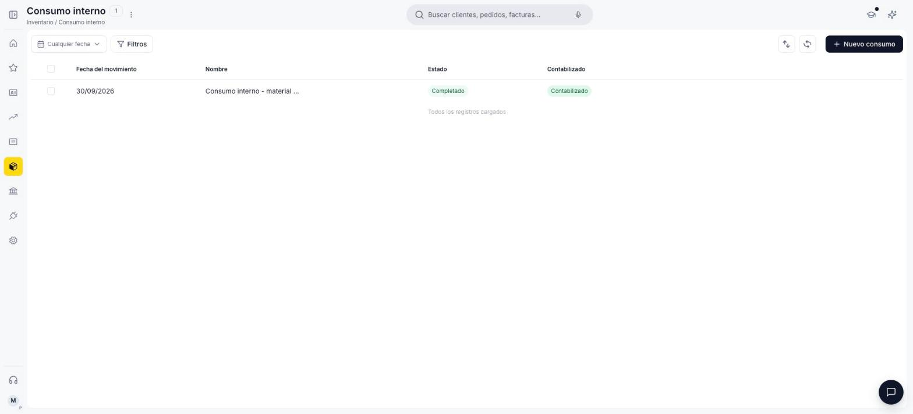
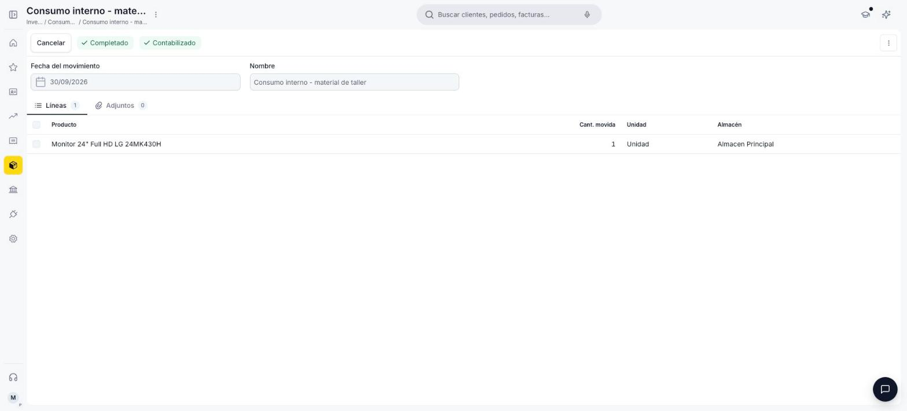

---
tags:
    - Consumo interno
    - Inventario
    - Almacén
    - Etendo
---

# ¿Qué es la sección Consumo interno?

La sección **Consumo interno** es donde registras salidas de stock que no son una venta — por ejemplo, mercadería dañada, muestras, uso interno o materia prima consumida en un proceso. A diferencia de un albarán de venta, un consumo interno no está asociado a ningún cliente ni genera una factura.

## Vista lista

La lista de Consumo interno muestra los documentos creados, con columnas **Fecha del movimiento**, **Nombre**, **Estado** (Borrador o Completado) y **Contabilizado**. Para registrar un consumo nuevo usa el botón **+ Nuevo consumo**.

<figure markdown="span">
  
  <figcaption>Vista lista de Consumo interno, con columnas de Fecha del movimiento, Nombre, Estado y Contabilizado.</figcaption>
</figure>

## Detalle de un consumo interno

El encabezado del documento incluye:

- **Fecha del movimiento** *(obligatorio)*.
- **Nombre** *(obligatorio)* — se autocompleta con la fecha, pero puede editarse.

A diferencia de un ajuste de [Inventario físico](../inventario-fisico/index.md), acá **no eliges un almacén en el encabezado**: cada línea define su propio almacén, junto con el producto. En las líneas agregas un renglón por producto:

- **Producto** — se busca de forma conjunta con el almacén (solo aparecen productos con stock disponible en algún almacén).
- **Cant. movida** *(obligatorio)* — la cantidad que sale del almacén.
- **Unidad** (solo lectura) — la unidad de medida del producto.
- **Almacén** — el almacén del que sale la mercadería, según el producto elegido.

Además de las líneas, cada consumo tiene una pestaña **Adjuntos** para sumar archivos relacionados.

<figure markdown="span">
  
  <figcaption>Detalle de un Consumo interno completado, con sus líneas de producto, unidad y almacén.</figcaption>
</figure>

## Qué pasa al confirmar el documento

Al hacer clic en **Confirmar**, el sistema resta el stock del almacén elegido en cada línea y el documento queda con estado **Completado** y bloqueado para edición: si te equivocaste, se corrige con un nuevo consumo. Contablemente, ese movimiento no se registra como venta: el sistema intenta contabilizarlo contra la cuenta de gastos definida en la [categoría del producto](../productos/index.md#categoria-y-configuracion-contable), en lugar de la cuenta de ingresos que usaría un albarán de venta — si esa contabilización falla, el documento queda marcado como "Error al contabilizar" pero la salida de stock ya se aplicó igual.

## Recursos y próximos pasos

Si en cambio la salida de stock corresponde a una venta a un cliente, usa la [sección Ventas](../../../comercial/ventas/que-es-la-seccion-ventas/que-es-la-seccion-ventas.md) en lugar de un consumo interno. Y si lo que necesitas es corregir el stock registrado tras un conteo físico, usa [Inventario físico](../inventario-fisico/index.md).

---

## Artículos Relacionados

- [¿Qué es la sección Inventario?](../que-es-inventario/que-es-inventario.md)
- [¿Qué es la sección Almacén?](../almacenes/index.md)
- [¿Qué es la sección Movimiento entre almacenes?](../movimiento-de-almacenes/index.md)

---
Esta obra está bajo la licencia :material-creative-commons: :fontawesome-brands-creative-commons-by: :fontawesome-brands-creative-commons-sa: [CC BY-SA 2.5 ES](https://creativecommons.org/licenses/by-sa/2.5/es/){target="_blank"} de [Futit Services S.L](https://etendo.software){target="_blank"}.
