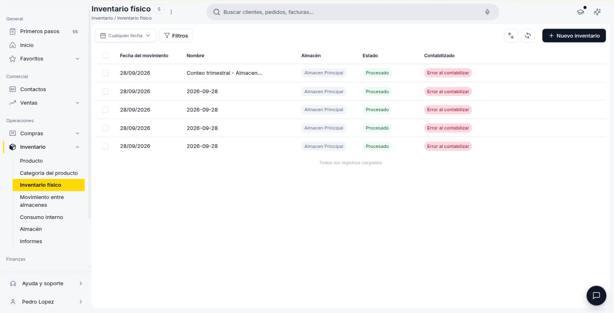
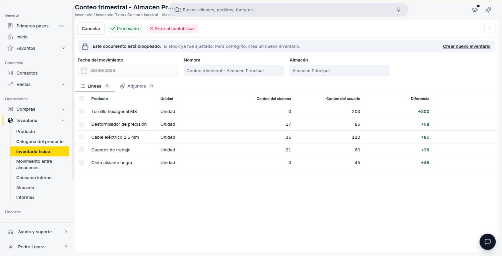

---
tags:
    - Inventario físico
    - Inventario
    - Almacén
    - Etendo
---

# ¿Qué es la sección Inventario físico?

La sección **Inventario físico** es donde concilias el stock que el sistema tiene registrado con el stock que cuentas realmente en un almacén. Se usa para corregir diferencias — por ejemplo, después de un conteo periódico, o para cargar el stock inicial de un almacén recién creado.

Un ajuste de inventario físico siempre se hace **por almacén**: eliges el almacén a contar, y el sistema compara la cantidad que tiene registrada de cada producto (conteo del sistema) contra la cantidad que ingresas (conteo del usuario). La diferencia entre ambas genera automáticamente el movimiento de stock necesario para igualarlas.

## Vista lista

<figure markdown="span">
  
  <figcaption>Vista lista de Inventario físico, con columnas de Fecha del movimiento, Nombre, Almacén, Estado y Contabilizado.</figcaption>
</figure>

La lista de Inventario físico muestra los ajustes creados, con columnas **Fecha del movimiento**, **Nombre**, **Almacén**, **Estado** (Borrador o Procesado) y **Contabilizado** (Sin contabilizar, Contabilizado o Error al contabilizar). Para iniciar un conteo nuevo usa el botón **+ Nuevo inventario**.

## Detalle de un ajuste

<figure markdown="span">
  
  <figcaption>Detalle de un ajuste de Inventario físico procesado, con sus líneas de producto y las cantidades resultantes.</figcaption>
</figure>

Al crear un ajuste se completa primero el encabezado:

- **Fecha del movimiento** *(obligatorio)* — fecha del conteo.
- **Nombre** *(obligatorio)* — se autocompleta con la fecha, pero puede editarse.
- **Almacén** *(obligatorio)* — el almacén que vas a contar. Una vez que el ajuste tiene líneas, este campo queda fijo.

Después cargas las líneas, una por producto contado. Tienes dos formas de hacerlo:

- **+ Añadir líneas** — agregas los productos uno a uno.
- **Generar líneas automáticamente** — el sistema crea una línea por cada producto del almacén elegido. Puedes filtrar por **Categoría de producto** y por **Cantidad de inventario** (por ejemplo, solo los productos con stock distinto de 0). Si ya no quedan existencias de esos productos en el almacén, marca **Establecer cantidad registrada en cero**: cada línea se crea con el conteo del usuario en 0, en lugar de precargarse con el conteo del sistema.

Al usar cualquiera de las dos, el encabezado se guarda automáticamente. Cada línea incluye:

- **Producto** *(obligatorio)*.
- **Unidad** (solo lectura) — la unidad de medida del producto.
- **Conteo del sistema** (solo lectura) — el stock que el sistema tiene registrado para ese producto en este almacén al momento del conteo. Se completa solo al elegir el producto.
- **Conteo del usuario** *(obligatorio)* — la cantidad que contaste realmente. Viene precargado con el conteo del sistema, para que solo corrijas los productos con diferencias.
- **Diferencia** (calculada) — la resta entre el conteo del usuario y el del sistema. Puede ser positiva (sobrante, en verde) o negativa (faltante, en rojo).

Además de las líneas, cada ajuste tiene una pestaña **Adjuntos** para sumar archivos relacionados (por ejemplo, fotos del conteo físico).

## Qué pasa al confirmar el ajuste

Al hacer clic en **Confirmar**, el sistema genera un movimiento de stock por cada línea con diferencia distinta de cero: suma stock si el conteo del usuario es mayor al del sistema, o lo resta si es menor.

El ajuste queda con estado **Procesado** y bloqueado para edición: si te equivocaste, se corrige con un nuevo ajuste.

Contablemente, el ajuste se registra contra la cuenta de ajuste de existencias definida en la [categoría del producto](../productos/index.md#categoria-y-configuracion-contable). La contabilización no es inmediata: justo después de confirmar, el ajuste aparece como **Sin contabilizar** hasta que un proceso automático lo contabiliza, al cabo de unos minutos. También puedes contabilizarlo manualmente sin esperar.

!!! warning "Si la contabilización falla"
    El ajuste queda marcado como "Error al contabilizar", pero el movimiento de stock ya se aplicó igual. Revisa la configuración contable de la categoría del producto.

## Recursos y próximos pasos

Es habitual usar un ajuste de inventario físico para cargar el stock inicial de un [almacén](../almacenes/index.md) recién creado, antes de empezar a operar con [compras](../../compras/que-es-la-seccion-compras/que-es-la-seccion-compras.md) y [ventas](../../../comercial/ventas/que-es-la-seccion-ventas/que-es-la-seccion-ventas.md). Si en cambio necesitas registrar una salida puntual de stock, usa [Consumo interno](../consumo-interno/consumo-interno.md); si necesitas transferir mercadería a otro almacén, usa [Movimiento entre almacenes](../movimiento-de-almacenes/movimiento-de-almacenes.md).

---

## Artículos Relacionados

- [¿Qué es la sección Inventario?](../que-es-inventario/que-es-inventario.md)
- [¿Qué es la sección de Productos?](../productos/index.md)
- [¿Qué es la sección Almacén?](../almacenes/index.md)

---
Esta obra está bajo la licencia :material-creative-commons: :fontawesome-brands-creative-commons-by: :fontawesome-brands-creative-commons-sa: [CC BY-SA 2.5 ES](https://creativecommons.org/licenses/by-sa/2.5/es/){target="_blank"} de [Futit Services S.L](https://etendo.software){target="_blank"}.
