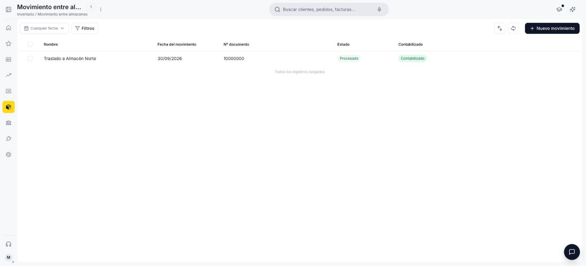
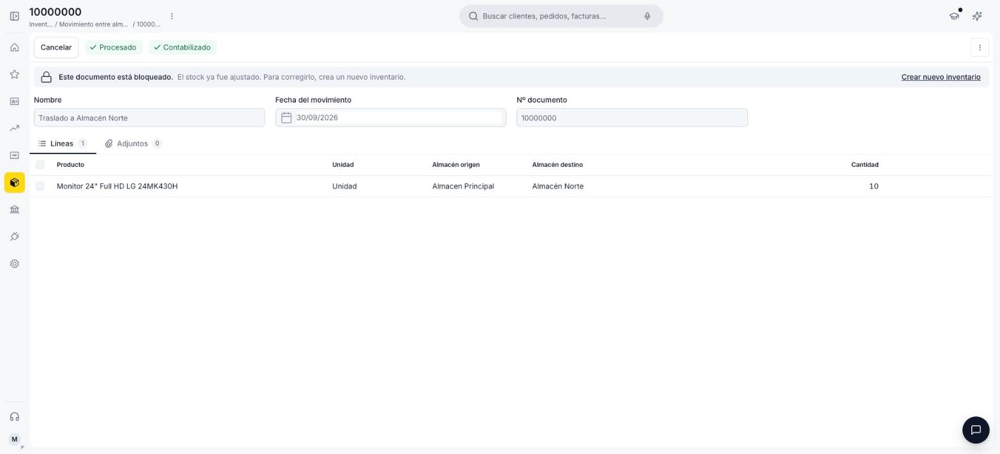

---
tags:
    - Movimiento entre almacenes
    - Inventario
    - Almacén
    - Etendo
---

# ¿Qué es la sección Movimiento entre almacenes?

La sección **Movimiento entre almacenes** es donde transfieres stock de un almacén a otro dentro de Etendo, sin que eso se registre como una venta ni como una compra. Se usa, por ejemplo, para redistribuir mercadería entre sucursales o para centralizar stock antes de un pedido grande.

## Vista lista

<figure markdown="span">
  
  <figcaption>Vista lista de Movimiento entre almacenes, con columnas de Nombre, Fecha del movimiento, Nº documento, Estado y Contabilizado.</figcaption>
</figure>

La lista de Movimiento entre almacenes muestra los movimientos creados, con columnas **Nombre**, **Fecha del movimiento**, **Nº documento**, **Estado** (Borrador o Procesado) y **Contabilizado** (Sin contabilizar o Contabilizado). Para registrar un movimiento nuevo usa el botón **+ Nuevo movimiento**.

## Detalle de un movimiento

<figure markdown="span">
  
  <figcaption>Detalle de un Movimiento entre almacenes procesado y contabilizado, con el producto, el almacén origen, el almacén destino y la cantidad transferida.</figcaption>
</figure>

El encabezado del documento incluye:

- **Nombre** *(obligatorio)* — se autocompleta con la fecha, pero puede editarse.
- **Fecha del movimiento** *(obligatorio)*.
- **Nº documento** (solo lectura) — número secuencial que asigna el sistema al crear el registro.

Para cargar productos haz clic en **+ Añadir líneas**: el encabezado se guarda automáticamente y se habilita la primera línea. En cada línea agregas un producto:

- **Producto** *(obligatorio)* — el buscador muestra los productos con stock y, al desplegar uno, los almacenes donde lo tiene y la cantidad disponible en cada uno. Al elegir un almacén de esa lista, se completan el producto y el almacén origen.
- **Unidad** (solo lectura) — la unidad de medida del producto.
- **Almacén origen** *(obligatorio)* — de dónde sale la mercadería. Se completa con la opción que elegiste en **Producto**.
- **Almacén destino** *(obligatorio)* — a dónde llega. El desplegable no muestra el almacén origen.
- **Cantidad** *(obligatorio)* — la cantidad a transferir. No puede superar el stock disponible del producto en el almacén origen: si lo supera, el sistema muestra un aviso con la cantidad disponible y no guarda la línea.

Además de las líneas, cada movimiento tiene una pestaña **Adjuntos** para sumar archivos relacionados.

## Qué pasa al procesar el movimiento

Al hacer clic en **Procesar**, el sistema resta la cantidad transferida del stock del almacén origen y la suma al stock del almacén destino. El stock total de la empresa no cambia: solo se redistribuye entre almacenes.

El documento queda con estado **Procesado** y bloqueado para edición: si te equivocaste, se corrige con un nuevo movimiento.

Igual que [Inventario físico](../inventario-fisico/inventario-fisico.md) y [Consumo interno](../consumo-interno/consumo-interno.md), la contabilización no es inmediata: justo después de procesar, el movimiento aparece como **Sin contabilizar** hasta que un proceso automático lo contabiliza, al cabo de unos minutos. También puedes contabilizarlo manualmente sin esperar.

## Recursos y próximos pasos

Antes de transferir stock entre dos almacenes, ambos deben existir: revisa cómo [crear un almacén](../almacenes/crear-un-almacen/crear-un-almacen.md) si todavía te falta alguno.

---

## Artículos Relacionados

- [¿Qué es la sección Inventario?](../que-es-inventario/que-es-inventario.md)
- [¿Qué es la sección de Productos?](../productos/index.md)
- [¿Qué es la sección Almacén?](../almacenes/index.md)

---
Esta obra está bajo la licencia :material-creative-commons: :fontawesome-brands-creative-commons-by: :fontawesome-brands-creative-commons-sa: [CC BY-SA 2.5 ES](https://creativecommons.org/licenses/by-sa/2.5/es/){target="_blank"} de [Futit Services S.L](https://etendo.software){target="_blank"}.
