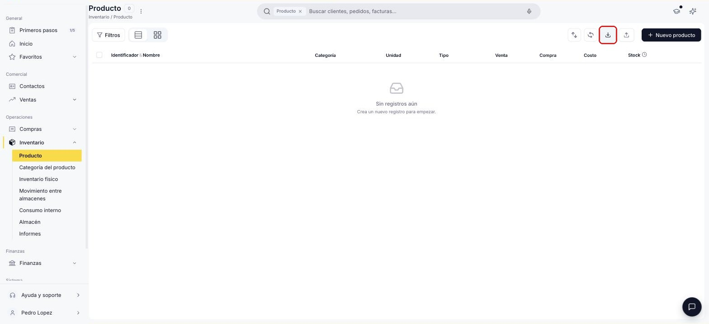
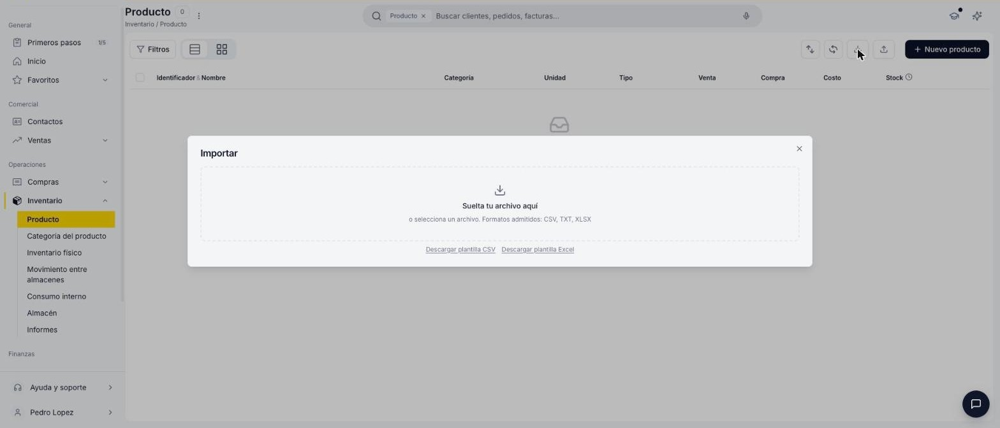
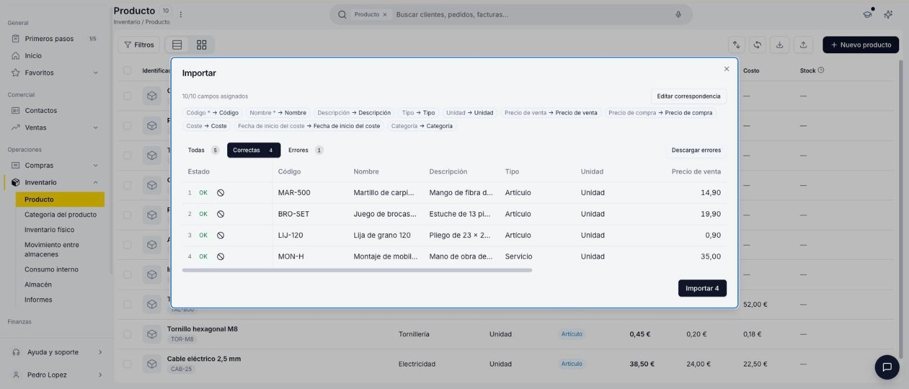
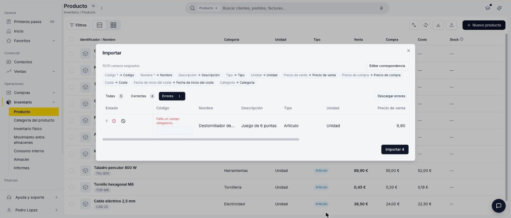
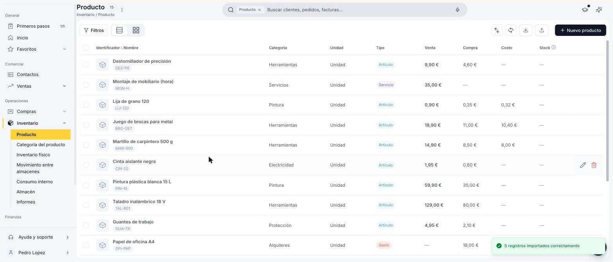

# Importar productos

Si necesitas dar de alta varios productos a la vez, en vez de crearlos uno por uno desde el formulario, puedes importarlos masivamente desde un archivo CSV, TXT o Excel.

## Antes de empezar

- **Solo se crean productos nuevos.** Si el **Código** ya existe, la fila se omite y el producto no se actualiza (tampoco sus precios). Si repites el mismo código en varias filas, solo se importa la primera.
- **Las categorías que no existen se crean automáticamente al importar.** Si quieres configurar una categoría tú mismo (por ejemplo, para definir sus cuentas contables), créala antes desde [Crear y configurar una categoría de producto](../crear-una-categoria-de-producto/crear-una-categoria-de-producto.md).

## Abre la ventana de importación

1. Ve a **[Inventario > Producto](https://app.etendo.software/product){target="_blank"}**.
2. En la vista lista, haz clic en el ícono **Importar** de la barra de herramientas superior.

    <figure markdown="span">
      
      <figcaption>Ícono Importar en la barra de herramientas de la ventana Producto.</figcaption>
    </figure>

## Descarga y completa la plantilla

1. En la ventana **Importar**, descarga la plantilla en **CSV** o **Excel**.

    <figure markdown="span">
      
      <figcaption>Ventana Importar: zona de carga de archivo y enlaces de descarga de plantilla.</figcaption>
    </figure>

2. Completa una fila por producto. Consulta qué va en cada columna en [Columnas de la plantilla](#columnas-de-la-plantilla).
3. Vuelve a la ventana **Importar** y arrastra tu archivo a la zona indicada, o haz clic para seleccionarlo desde tu ordenador.

## Columnas de la plantilla

| Columna | Obligatoria | Qué poner |
|---|---|---|
| **Código** | Sí | El código con el que identificas el producto (SKU). |
| **Nombre** | Sí | Nombre comercial del producto. |
| **Descripción** | No | Texto libre. |
| **Tipo** | No | **Artículo**, **Servicio**, **Recurso** o **Gasto**. Si lo dejas vacío, se asigna **Artículo**. |
| **Unidad** | No | Una unidad de medida que ya exista (ej. *Unidad*, *Kilogramo*, *Litro*). Si la dejas vacía, se asigna **Unidad**. |
| **Precio de venta** | No | Se carga en la **Tarifa de venta principal**. Escribe el importe como *1234,56* o *1.234,56*. |
| **Precio de compra** | No | Se carga en la **Tarifa de compra principal**, con el mismo formato. |
| **Coste** y **Fecha de inicio del coste** | No | Coste del producto y fecha desde la que rige (*dd/mm/aaaa*). Aparece en la solapa **Costo** del producto. |
| **Categoría** | No | Categoría de producto. Complétala siempre (ver aviso). |

!!! warning "Completa siempre la Categoría"
    Aunque la plantilla no la marca como obligatoria, si la dejas vacía el producto puede quedar con una categoría que no esperabas. Revisa la categoría de cada fila antes de importar.

## Revisa la correspondencia de columnas

1. Comprueba que cada columna de tu archivo esté emparejada con su campo. Encima de la lista aparece cuántos campos se asignaron, por ejemplo "10/10 campos asignados".
2. Si alguna columna no se asignó bien, haz clic en **Editar correspondencia** y corrígela.

## Revisa las filas correctas y con errores

Etendo separa las filas de tu archivo en tres pestañas: **Todas**, **Correctas** (listas para importarse) y **Errores** (con el motivo en rojo junto al campo). Los errores más habituales son:

- **"Falta un campo obligatorio."** — el **Código** o el **Nombre** están vacíos.
- **"El valor ... no coincide con ningún registro existente."** — la **Unidad** no existe. Elige la correcta en la lista desplegable de la celda.
- **"El valor ... no es un número válido."** — un precio o coste con letras o un formato incorrecto.
- **"La fecha ... no es válida."** — la fecha de inicio del coste no está en formato *dd/mm/aaaa*.

<figure markdown="span">
  
  <figcaption>Pestaña Correctas: filas validadas, listas para importar.</figcaption>
</figure>

<figure markdown="span">
  
  <figcaption>Pestaña Errores: fila sin Código, editable en la misma tabla.</figcaption>
</figure>

Para cada fila de la pestaña **Errores**, elige una opción:

- **Corregirla en la tabla:** escribe el dato en la celda resaltada. Al salir de la celda, la fila pasa a **Correctas**.
- **Corregirla en tu archivo:** haz clic en **Descargar errores**, corrige esas filas y vuelve a importarlas después.
- **Dejarla fuera:** haz clic en el icono **Omitir** (⊘) de la fila.

!!! info "Importar solo lo que está correcto"
    No hace falta que corrijas los errores para avanzar: el botón **Importar** solo carga las filas de la pestaña **Correctas**.

## Importa los productos

1. Haz clic en **Importar [cantidad]**.
2. En el diálogo **Confirmar importación**, revisa cuántos registros se importan y cuántas filas se omiten. Luego haz clic en **Confirmar importación**.
3. Espera a que termine la barra de progreso. El mensaje "[cantidad] registros importados correctamente" confirma la carga, y los productos ya aparecen en la vista lista.

    <figure markdown="span">
      
      <figcaption>Vista lista de Producto después de una importación exitosa.</figcaption>
    </figure>

## Artículos Relacionados

- [Crear un producto](../crear-un-producto/crear-un-producto.md)
- [Crear y configurar una categoría de producto](../crear-una-categoria-de-producto/crear-una-categoria-de-producto.md)
- [Gestionar tarifas de producto](../gestionar-tarifas-de-producto/gestionar-tarifas-de-producto.md)

---
Esta obra está bajo la licencia :material-creative-commons: :fontawesome-brands-creative-commons-by: :fontawesome-brands-creative-commons-sa: [CC BY-SA 2.5 ES](https://creativecommons.org/licenses/by-sa/2.5/es/){target="_blank"} de [Futit Services S.L](https://etendo.software){target="_blank"}.
