# Cómo crear tu cuenta

Crear tu cuenta es gratis y no necesitas tarjeta de crédito. El recorrido tiene cinco fases: creas tu cuenta, pruebas Etendo en un entorno de demo, creas tu entorno productivo, completas las tareas del panel **Primeros pasos** y emites tu primera factura. La demo es gratuita y te sirve para probar; el entorno productivo es un plan de pago y lo necesitas para facturar con validez ante Hacienda.

## 1. Crea tu cuenta

### Regístrate

1. Accede a la página de registro de Etendo. Verás el formulario **Crea tu cuenta gratis**.

    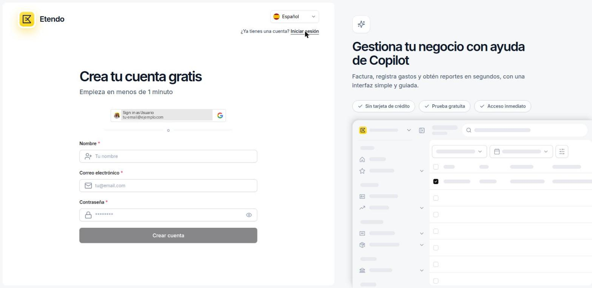

    !!! tip "Idioma"
        Antes de empezar, puedes cambiar el idioma de la interfaz desde el selector **IDIOMA**, en la parte superior del formulario.

    !!! tip "Registrarte con Google"
        También puedes crear la cuenta con un clic usando la opción **Sign in as...** con tu cuenta de Google, en lugar de completar el formulario.

2. Completa los campos obligatorios:
    - **Nombre** — tu nombre completo como administrador de la cuenta.
    - **Correo electrónico** — la dirección que usarás para iniciar sesión.
    - **Contraseña** — debe cumplir todos los requisitos que aparecen en pantalla.

    !!! info "Requisitos de la contraseña"
        Debe tener al menos 8 caracteres e incluir una letra mayúscula, una minúscula, un número y un carácter especial (`!@#$%...`).

3. Haz clic en **Crear cuenta**.

### Confirma tu correo

Antes de continuar, Etendo te pide que confirmes tu dirección de correo.

1. Abre la bandeja de entrada del correo con el que te registraste.

    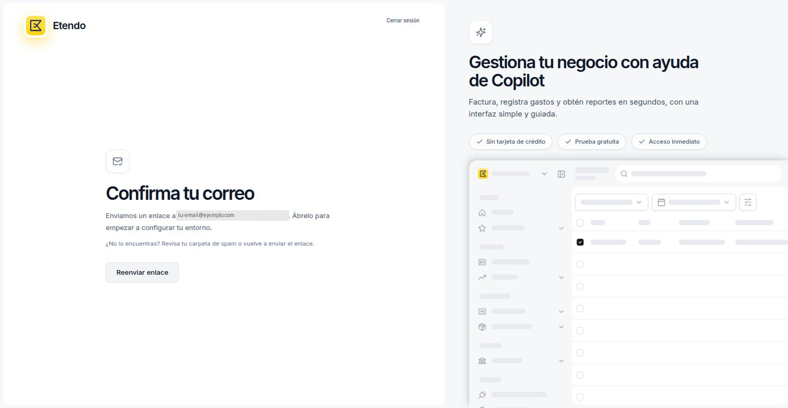

2. Haz clic en el enlace que Etendo te envía. Al confirmarlo, Etendo te lleva automáticamente al paso de perfil.

!!! tip "¿No te ha llegado el correo?"
    Revisa tu carpeta de spam o haz clic en **Reenviar enlace** desde esta misma pantalla.

### Completa tu perfil

1. Revisa el **Nombre completo**. Se rellena automáticamente con el nombre del paso anterior.

    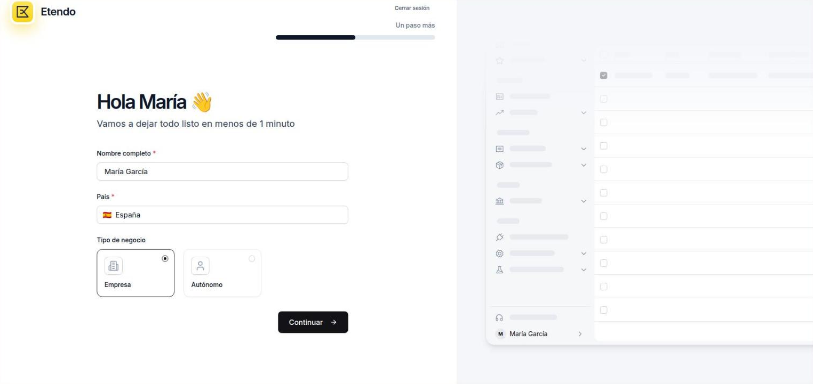

2. Selecciona tu **País**. Para empresas españolas, aparece *España* por defecto.
3. Elige el **Tipo de negocio**:
    - **Empresa** — sociedades como S.L. o S.A., o cooperativas.
    - **Autónomo** — trabajador por cuenta propia.
4. Haz clic en **Continuar**.

### Introduce los datos de tu empresa

Etendo usa estos datos en tus facturas y documentos comerciales.

1. Completa los campos:

    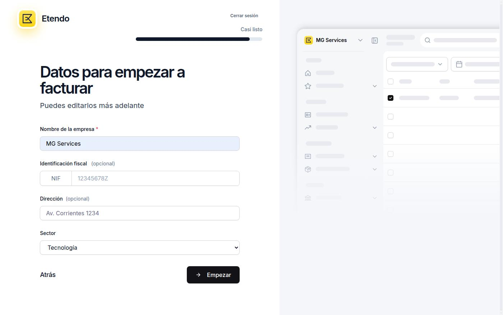

    - **Nombre de la empresa** — razón social completa (ej. *MG Services S.L.*). Obligatorio.
    - **Identificación fiscal (NIF)** — el NIF de una empresa empieza por letra (ej. *B12345678*); si eres autónomo, introduce tu DNI o NIE. Es opcional en este paso, pero lo necesitas antes de emitir facturas y conectar con Hacienda.
    - **Dirección** — dirección fiscal. Opcional.
    - **Sector** — actividad principal de la empresa. Por defecto, *Tecnología*. Opcional.

    !!! info "Edición posterior"
        Puedes modificar todos estos datos cuando quieras desde [**Configuración > Organización**](https://app.etendo.ai/organization){target="_blank"}.

2. Haz clic en **Empezar**.

Etendo prepara el espacio de trabajo de tu empresa. El proceso tarda unos segundos.

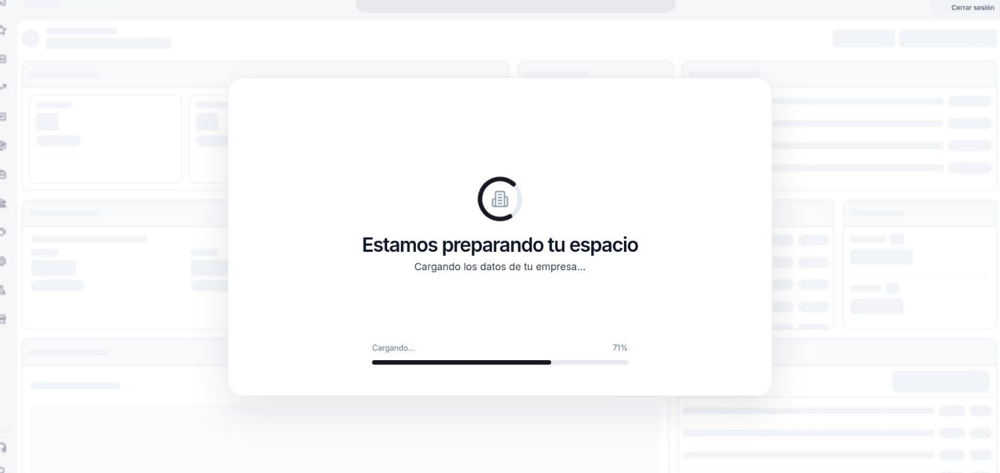

## 2. Conoce tu entorno de pruebas (demo)

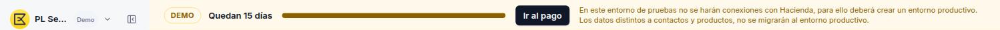

!!! tip "Para qué sirve la demo"
    La demo es un entorno funcional para hacer todo tipo de pruebas en el sistema. No se conecta con Hacienda ni emite facturas con validez legal. Cuando termines de probar, creas tu entorno productivo con toda tu información real, y desde ahí envías facturas legales. Al pasar a productivo, puedes transferir los **contactos** y **productos** que añadiste en la demo.

En cuanto tu espacio está listo, tu cuenta funciona como un **entorno de pruebas (demo)** durante 15 días. Etendo te lo recuerda en dos lugares:

- La etiqueta **Demo**, junto al nombre de tu empresa, en la esquina superior izquierda.
- Una barra en la parte superior de la pantalla, con los días restantes y el botón [**Ir al pago**](https://app.etendo.ai/upgrade){target="_blank"}.

## 3. Crea tu entorno productivo

El entorno productivo es tu cuenta real, la que se conecta con Hacienda. Es independiente de la demo: la demo se mantiene tal como está, no se elimina.

Haz clic en [**Ir al pago**](https://app.etendo.ai/upgrade){target="_blank"} para abrir el asistente de 3 pasos.

### Elige el plan

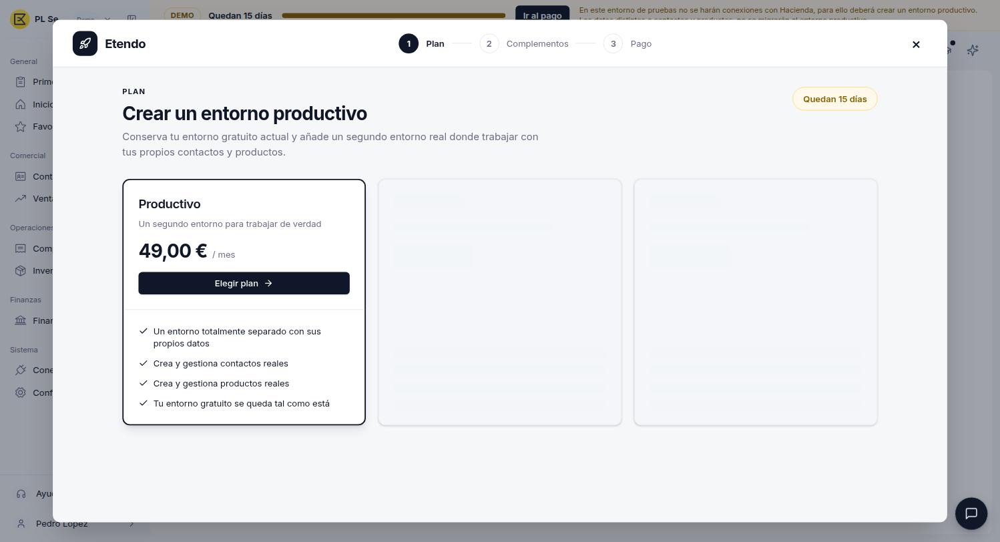

Selecciona el plan **Productivo**.

### Transfiere tus datos de la demo

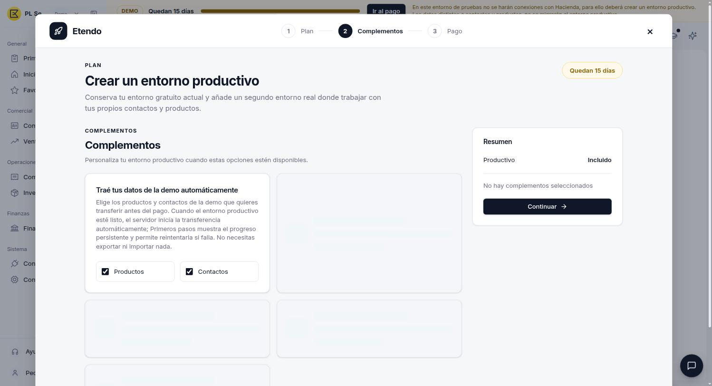

Decide si quieres traer los **Productos** y **Contactos** que añadiste en la demo. Ambas casillas vienen marcadas por defecto. Son los únicos datos que puedes transferir: el resto de la información de la demo no pasa al entorno productivo.

Etendo hace la transferencia automáticamente en cuanto el entorno productivo está listo, sin que tengas que exportar ni importar nada.

### Completa el pago

Introduce los datos de facturación para activar el entorno productivo. Al activarlo, Etendo te lleva al panel **Primeros pasos** de tu entorno productivo. Lo reconoces por la etiqueta **Productivo**, junto al nombre de tu empresa, en la esquina superior izquierda.

La demo sigue disponible: puedes cambiar entre la demo y el entorno productivo desde el [Selector de empresa](../navegar-en-etendo/navegar-en-etendo.md#selector-de-empresa) (menú **Cambiar empresa**, junto al logo).

## 4. Completa las tareas del panel Primeros pasos

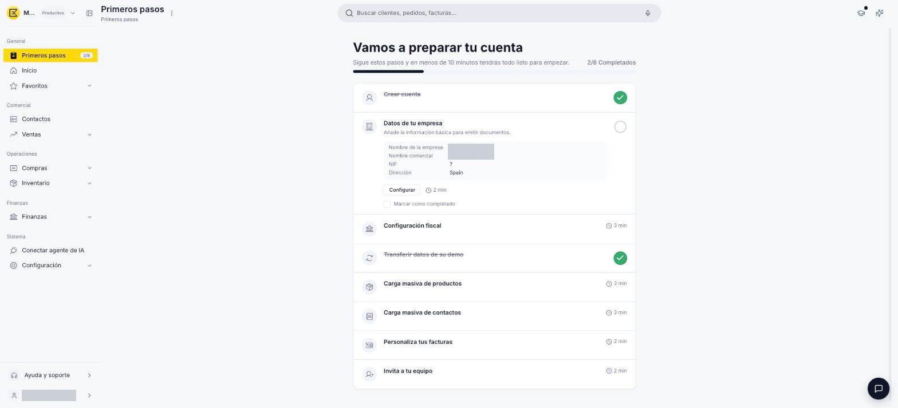

El panel **Primeros pasos** te guía por la configuración básica de tu cuenta. Se abre con el título *"Vamos a preparar tu cuenta"* y un contador de progreso (ej. *2/8 Completados*). Cada tarea se despliega al pulsarla; las que no se completan solas tienen la casilla **Marcar como completado**.

- **Crear cuenta** — se completa sola al terminar el registro.
- **Datos de tu empresa** — muestra un resumen de los datos que introdujiste al registrarte (nombre de la empresa, nombre comercial, NIF y dirección). Revísalos y, si alguno es incorrecto o falta, corrígelo: **Configurar** te lleva a [**Configuración > Organización**](https://app.etendo.ai/organization){target="_blank"}. Cuando estén bien, márcala como completada.
- **Configuración fiscal** — pregunta *"¿Debe informar las facturas a algún Sistema de Facturación (SIF), como SII, Verifactu o TicketBai?"*. Si respondes **Sí**, **Configurar** te lleva a elegir tu territorio fiscal y el sistema que te corresponde (SII, TicketBAI o VERI\*FACTU). Si no sabes cuál te corresponde, consúltalo con tu asesoría. Más información en [Configuración fiscal](../../sistema/configuracion/configuracion-fiscal/configuracion-fiscal.md).
- **Transferir datos de su demo** — muestra el estado de la transferencia de productos y contactos que elegiste al crear el entorno productivo. Se completa sola.
- **Carga masiva de productos** — importa tu catálogo desde una hoja de cálculo. **Importar** abre una ventana para arrastrar o seleccionar un archivo CSV, TXT o XLSX, con plantillas descargables listas para completar.

    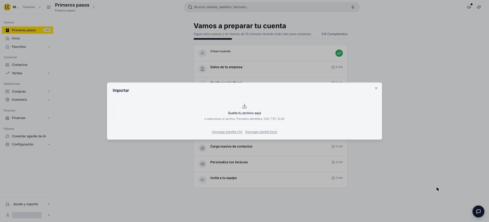

- **Carga masiva de contactos** — importa tus clientes y proveedores para empezar a facturar cuanto antes. **Importar** abre la misma ventana de importación.
- **Personaliza tus facturas** — define el prefijo y el número inicial de tus facturas; conviene hacerlo antes de emitir la primera. **Configurar** te lleva a [**Configuración > Secuencias de documentos**](https://app.etendo.ai/document-sequence){target="_blank"}. Más información en [Secuencias de documentos](../../sistema/configuracion/secuencias-de-documentos/secuencias-de-documentos.md).
- **Invita a tu equipo** — invita a las personas que trabajarán contigo y decide qué puede hacer cada una. **Configurar** te lleva a [**Configuración > Usuarios**](https://app.etendo.ai/user){target="_blank"}:
    1. Haz clic en [**Nuevo usuario**](https://app.etendo.ai/user/new){target="_blank"}.

        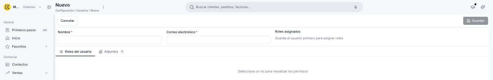

    2. Completa **Nombre** y **Correo electrónico** (obligatorios) y guarda el usuario.
    3. Añade los **Roles asignados** después de guardar.

    Para el detalle, consulta [Cómo invitar a un usuario](../../sistema/configuracion/como-invitar-a-un-usuario/como-invitar-a-un-usuario.md).

## 5. Crea tu primera factura

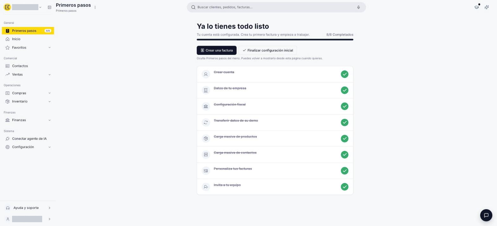

Cuando completas las 8 tareas, el panel muestra *"Ya lo tienes todo listo"*, el texto *"Tu cuenta está configurada. Crea tu primera factura y empieza a trabajar."* y el contador *8/8 Completados*. Aparecen dos botones:

- **Crear una factura** — abre directamente una nueva factura de venta. Para completarla, sigue [Crear una factura de venta](../../comercial/ventas/crear-una-factura-de-venta/crear-una-factura-de-venta.md).
- **Finalizar configuración inicial** — oculta **Primeros pasos** del menú. A partir de ahí, cualquier ajuste lo haces desde la ventana correspondiente en **Configuración**.

## Artículos Relacionados

- [Crear una factura de venta](../../comercial/ventas/crear-una-factura-de-venta/crear-una-factura-de-venta.md)
- [Cómo gestionar tu organización](../../sistema/configuracion/como-gestionar-tu-organizacion/como-gestionar-tu-organizacion.md)
- [¿Qué es Etendo?](../que-es-etendo/que-es-etendo.md)

---
Esta obra está bajo la licencia :material-creative-commons: :fontawesome-brands-creative-commons-by: :fontawesome-brands-creative-commons-sa: [CC BY-SA 2.5 ES](https://creativecommons.org/licenses/by-sa/2.5/es/){target="_blank"} de [Futit Services S.L](https://etendo.software){target="_blank"}.
